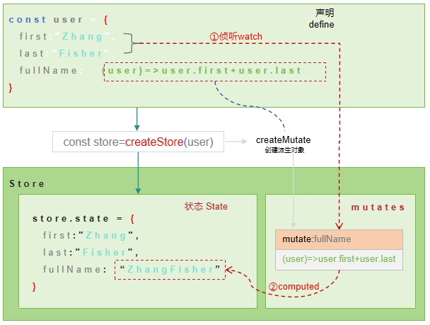

---
group:
  title: 计算属性
  order: 2
title: 入门
order: 0  
demo:
  tocDepth: 5
---

## 介绍

细心的朋友可能发现，在上面的`createStore`中我们没有声明任何的计算属性，但这并不是不支持计算属性，而是`@speedform/reactive`提供了**独特的计算属性的声明方式**。`@speedform/reactive`提供的计算属性的声明方式是`SpeedForm`之所以能提供无以伦比用户开发体验的关键。

## 基本原理

:::info
**`@speedform/reactive`实现了最独特的移花接木式的计算属性实现方式**
:::



**基本过程如下：**

1. 首先直接在`State`中声明计算属性函数，如`fullName=(user)=>user.first+user.last`。
2. 调用`createStore`创建`Store`时，会根据`State`中的函数来创建`mutate`或`computed`(在`helux`中叫派生对象，在其他状态库中可能叫计算算属性)。
3. 如此，当`State`中的数据变化时，会自动触发计算属性的重新计算，将计算结果赋值给`State`中的对应属性。在上图中，当`firstName`和`lastName`变化时，会自动触发`fullName(mutate)`的重新计算，将计算结果赋值给`user.fullName`属性。这样，当我们访问`state.fullName`时,就是一个字符串了，而不是一个函数了。

**以上就是`@speedform/reactive`计算属性移花接木的过程原理,大家可以从下面示列中加深理解。**

```tsx
/**
 * defaultShowCode: true
 */
import { createStore } from '@speedform/reactive'; 
import { Divider} from "@speedform/demo-components"

const user = {
  firstName:"Zhang",
  lastName:"Fisher",
  fullName: (user)=>{ 
    return user.firstName+user.lastName
  }
}

const store = createStore(user,{singleton:false})
 
export default ()=>{
  const [state,setState] = store.useState()
  return (<div>
    <h4>声明时fullName是一个函数</h4>
    <div>typeof(user.fullName)={typeof(user.fullName)}</div>
    <Divider />
    <h4>创建Store后,state.fullName是一个字符串</h4>
    <div>typeof(store.state.fullName)={typeof(state.fullName)}</div>
    <div>store.state.fullName=={state.fullName}</div> 
  </div>)
}
```

在上例中：
- `user.fullName`是一个函数
- `store.state.fullName`是一个字符串
- 默认情况下，`createStore`直接在输入的`user`上进行创建，指定`singleton:false`时会深拷贝一份`user`，然后在拷贝的`user`上创建`mutate`或`computed`。

## 作用域

在学习如何声明创建计算属性之前，我们先来了解一下`计算作用域 - Scope`的概念。

:::info
 **`计算作用域`指的是传递给计算函数的第一个参数**
:::

`@speedform/reactive`在创建`Store`时，支持配置`scope`参数来指定计算属性函数的第一个参数，如下：

```ts
export enum ComputedScopeRef{
  Root    = 'root',                      // 指向State根对象
  Current = 'current',                // 指向计算属性所在的对象
  Parent  = 'parent',                  // 指向计算属性所在对象的父对象
  Depends = 'depends'                 // 指向异步计算的依赖数组，仅在异步计算时生效
  Self    = 'self'                    // 指向自身，默认值   
}

// 指定Store中计算函数的上下文,如果是字符串代表是当前对象的指定键，如果是string[]，则代表是当前Store对象的完整路径
export type ComputedScope  =  ComputedScopeRef | string | string[] | ((state:any)=>string | string[] | ComputedScopeRef)
 
const store = createStore( {
  user:{
    firstName:"Zhang",
    lastName:"Fisher",
    fullName: computed((scope)=>{
      // ...
    },["user.firstName","user.lastName"])
  }
} )

```

### Current

默认情况下，`scope==ComputedScopeRef.Current`时，计算函数的`this`指向计算函数所在的对象。

```tsx 
/**
 * title: ComputedScopeRef.Current
 * description: store.options.scope==ComputedScopeRef.Current,
 */
import { createStore,ComputedScopeRef } from '@speedform/reactive'; 
const state = {
  user:{
    firstName:"Zhang",
    lastName:"Fisher",
    fullName: function(scope){
      // scope指向user对象      
      return scope.firstName+scope.lastName
    }
  }
} 
const store = createStore(state,{
  // 指定计算属性的默认上下文指向计算函数所有的当前对象
  scope: ()=>ComputedScopeRef.Current,
})

export default ()=>{
  const [state,setState] = store.useState()
  return <div> 
    <div>FullName:{state.user.fullName}</div>
  </div>
}
```

### Root

`@speedform/reactive`会将计算属函数的`scope`指向`ComputedScopeRef.Root`，即当前的`State`根对象，如下：

```tsx 
/**
 * title: ComputedScopeRef.Root
 * description: store.options.scope==ComputedScopeRef.Root,
 */
import { createStore,ComputedScopeRef } from '@speedform/reactive'; 
 
const store = createStore({
  user:{
    firstName:"Zhang",
    lastName:"Fisher",
    fullName: function(scope){
      // scope指向State根对象      
      return scope.user.firstName+scope.user.lastName
    }
  }
},{
  // 指定计算属性的默认上下文指向State根对象
  scope: () => ComputedScopeRef.Root
})

export default ()=>{
  const [state,setState] = store.useState()
  return <div> 
    <div>FullName:{state.user.fullName}</div>
  </div>
}

``` 


#### Parent

当`scope==ComputedScopeRef.Parent`时，指向计算函数所在的对象的父对象。

```tsx 
/**
 * title: ComputedScopeRef.Parent
 * description: scope==ComputedScopeRef.Parent
 */
import { createStore,ComputedScopeRef } from '@speedform/reactive'; 
const state = {
  user:{
    firstName:"Zhang",
    lastName:"Fisher",
    fullName: function(scope){
      // scope指向user对象的父对象，即根
      return scope.user.firstName+scope.user.lastName
    }
  }
} 
const store = createStore(state,{
  // 指定计算属性的默认上下文指向计算函数所有的当前对象
  scope: ()=>ComputedScopeRef.Parent,
})

export default ()=>{
  const [state,setState] = store.useState()
  return <div> 
    <div>FullName:{state.user.fullName}</div>
  </div>
}
```


### 字符串

当`store.options.scope==<字符串>`时，此时`<字符串>`就是指向计算函数所在对象的键名称。

```tsx
/**
 * title: <字符串>
 * description: store.options.scope==<字符串>
 */
import { createStore } from '@speedform/reactive'; 

const state = {
  user:{
    firstName:"Zhang",
    lastName:"Fisher",
    fullName: function(scope){
      // this指向user对象的firstName
      return scope
    },
    address:{
      city:"Quanzhou",
    }
  }
} 
const store = createStore(state,{
  scope: ()=>'firstName'
})

export default ()=>{
  const [state,setState] = store.useState()
  return <div> 
    <div>FullName:{state.user.fullName}</div>
  </div>
}

```

- `computedThis='firstName'`代表`this`指向`user.firstName`,也就是当前计算函数所在对象的`firstName`成员。
- `computedThis='address.city'`代表`this`指向`user.address.city`
- 总之，当`computedThis`是一个字符串时，代表是**当前计算函数所在对象的指定键名称**，并且这个键名称可以是多级的，如`address.city`。

### 字符串数组 

```tsx
/**
 * title: <字符串数组>
 * description: scope==<字符串数组>
 */
import { createStore } from '@speedform/reactive'; 

const state = {
  user:{
    firstName:"Zhang",
    lastName:"Fisher",
    fullName: function(scope){ 
      return scope
    },
    address:{
      city:"Quanzhou",
    }
  }
} 
const store = createStore(state,{
  scope: ()=>['user','address','city']
})

export default ()=>{
  const [state,setState] = store.useState()
  return <div> 
    <div>FullName:{state.user.fullName}</div>
  </div>
}

```
`scope==<字符串数组>`与`scope==<字符串>`的区别在于:
- `scope==<字符串数组>`代表是以**根对象**为起点的完整路径，并且这个路径可以是多级的，如`['user','address','city']`。
- `scope==<字符串>`代表是以**当前计算函数所在对象**为起点的路径，并且这个键名称可以是多级的，如`address.city`。


### Depends

当`scope==ComputedScopeRef.Depends`时，计算函数的`this`指向计算函数的依赖项的值。

:::warn
**`ComputedScopeRef.Depends`仅在异步计算时生效,而异步计算必须通过computed函数来指定依赖**
:::
 
```tsx
/**
 * title: <字符串数组>
 * description: scope==<字符串数组>
 */
import { createStore,computed,ComputedScopeRef  } from '@speedform/reactive'; 

const state = {
  user:{
    firstName:"Zhang",
    lastName:"Fisher",
    fullName: computed(async (deps)=>{ 
      return deps[0] + deps[1]
    },
      // 声明依赖
      ['user.firstName','user.lastName'], 
    {      
      async:true,
      scope:ComputedScopeRef.Depends
    }) 
  }
} 
const store = createStore(state)

export default ()=>{
  const [state,setState] = store.useState()
  return <div> 
    <div>FullName:{state.user.fullName.result}</div>
  </div>
}

```  
 
 
 
