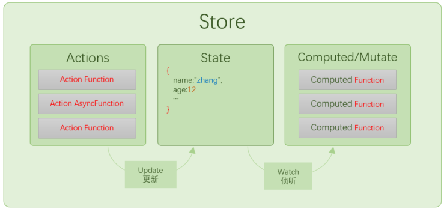

---
group:
  title: 基础
  order: 1 
title: Store
order: 1  
demo:
  tocDepth: 5
---

## 介绍

创建`SpeedForm`时对应创建一个`Store`对象,就如同`Redux`中的`Store`一样,`Store`本质上就是受控的状态数据对象，使用`helux`的`atomx/sharex`创建。

典型的`Store`结构如下：



- `Store`对象中会定义`State`数据结构，一般情况下不允许直接修改`State`数据，而是通过`Action`来修改`State`数据。
- `Action`是一个普通的函数，一般会实现某种业务逻辑，可以是同步函数，也可以是异步函数。执行成功会修改`State`数据。
- 计算属性会侦听`State`的数据变化，当`State`数据变化时，会自动重新计算计算属性的值。

## 创建

`@speedform/reactive`提供了`createStore`方法用来创建`Store`对象。

```ts 
const user = {
  firstName:"Zhang",
  lastName:"Fisher",
  age:18
}
 
const store = createStore({
  state:user,       // 声明状态数据
  actions:{},     // 声明状态数据更新方法
},{
  // ...配置参数
})

```

## 配置

`createStore`方法的第二个参数是配置，用来配置`Store`的行为。

```ts
export interface StoreOptions{    
    // 计算函数的默认上下文，即传入的给计算函数的draft对象是根state还是所在的对象或父对象
    // 如果未指定时，同步计算的上下文指向current，异步指定的上下文指向root
    computedThis?: StoreComputedContext
    computedScope?: StoreComputedScope
    // 当创建计算属性前调用
    onCreateComputed?:(keyPath:string[],getter:Function,options:ComputedOptions)=>Function | void    
}
```
